

# Noctis theme ported by referring [Noctis](https://github.com/liviuschera/noctis)

## Theme Variants

### Noctis

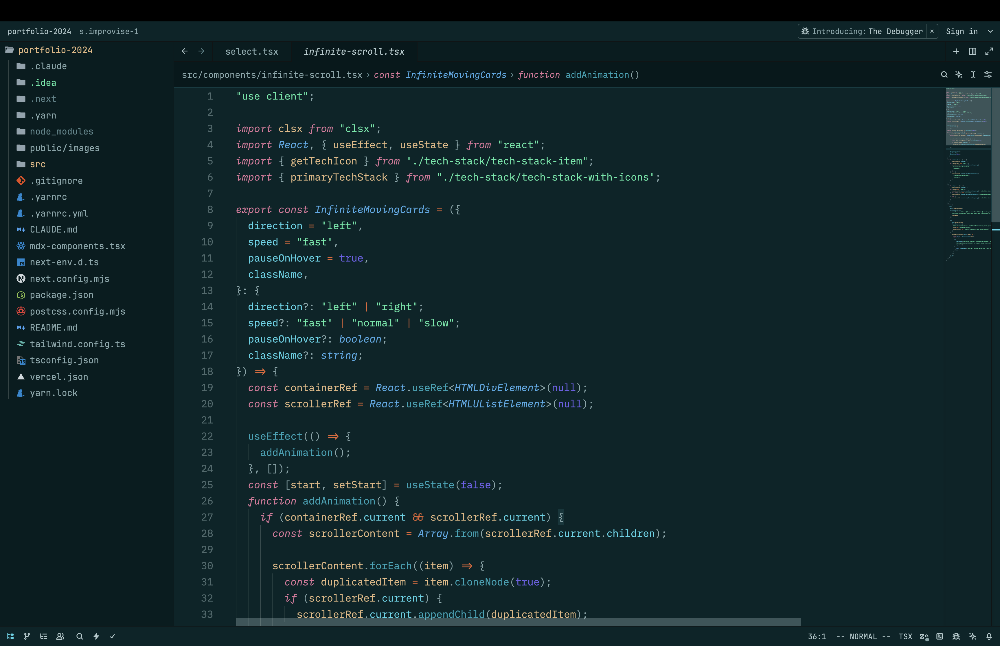

### Azureus

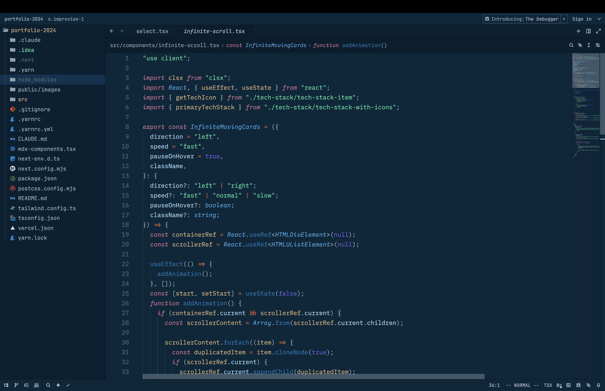

### Bordo

### Hibernus

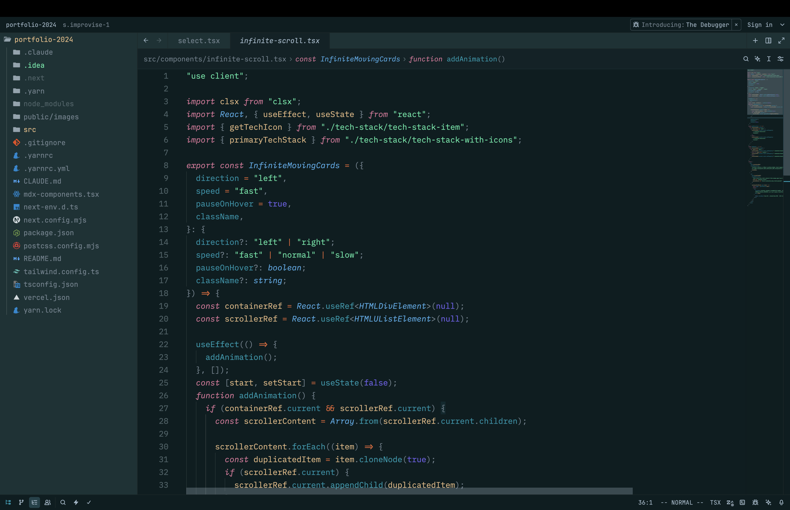

### Hibernus Light

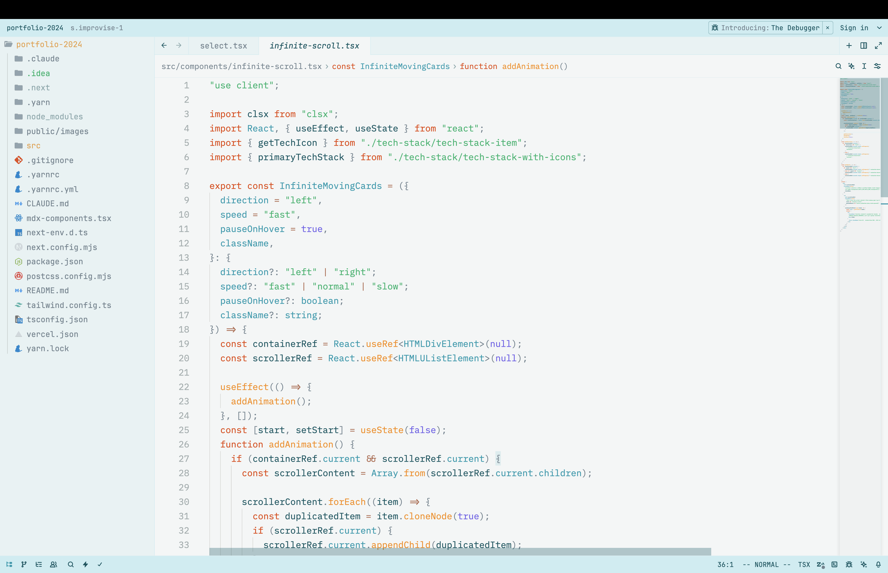

### Lilac

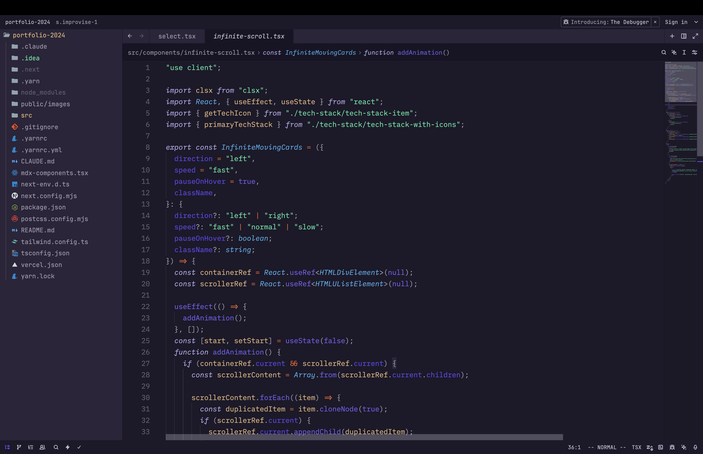

### Lilac Light

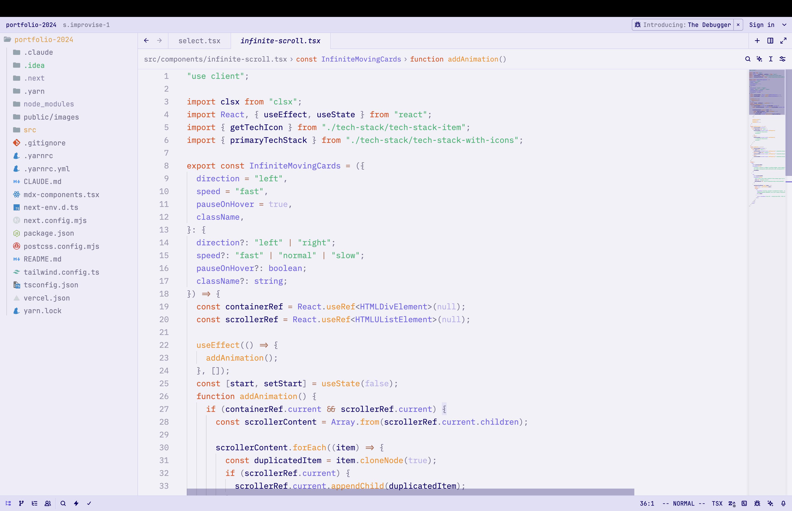

### Lux

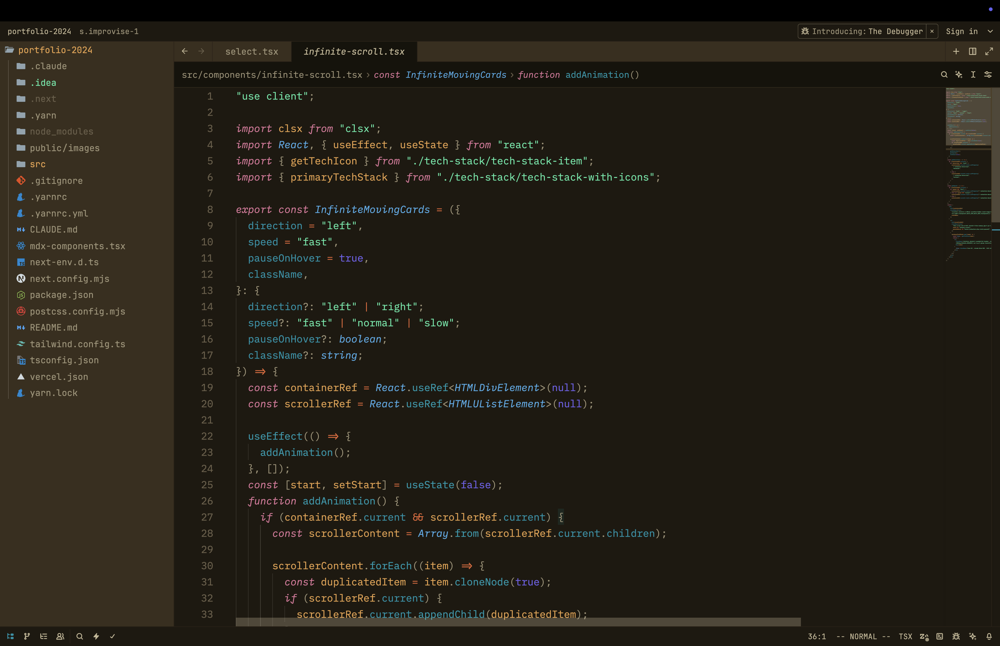

### Lux Light

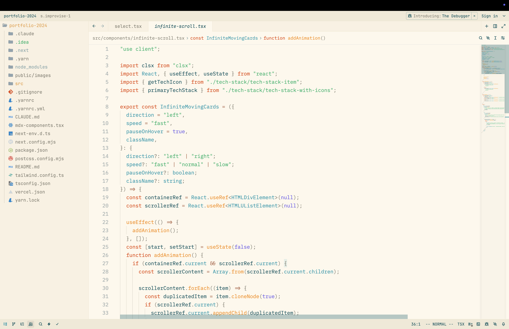

### Minimus

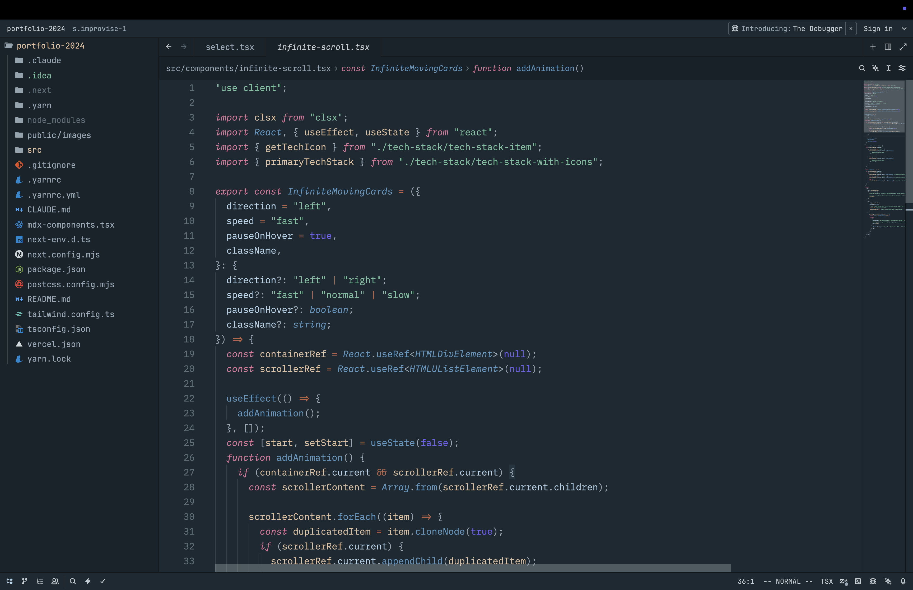

### Obscuro

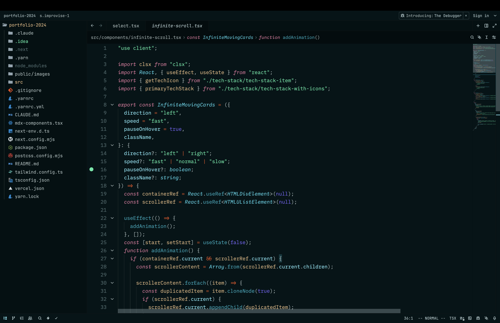

### Sereno

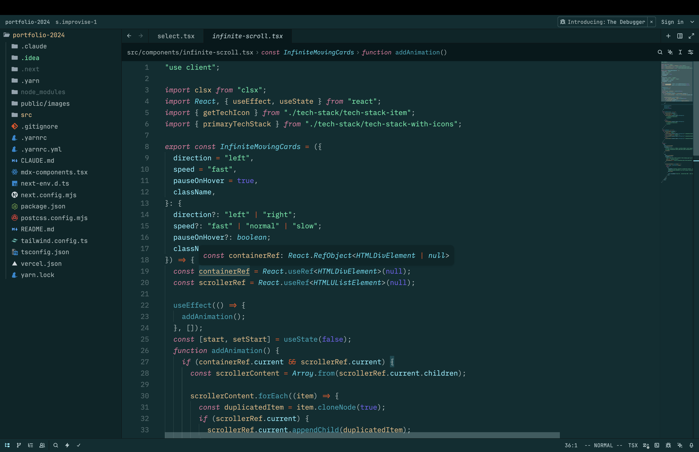

### Uva

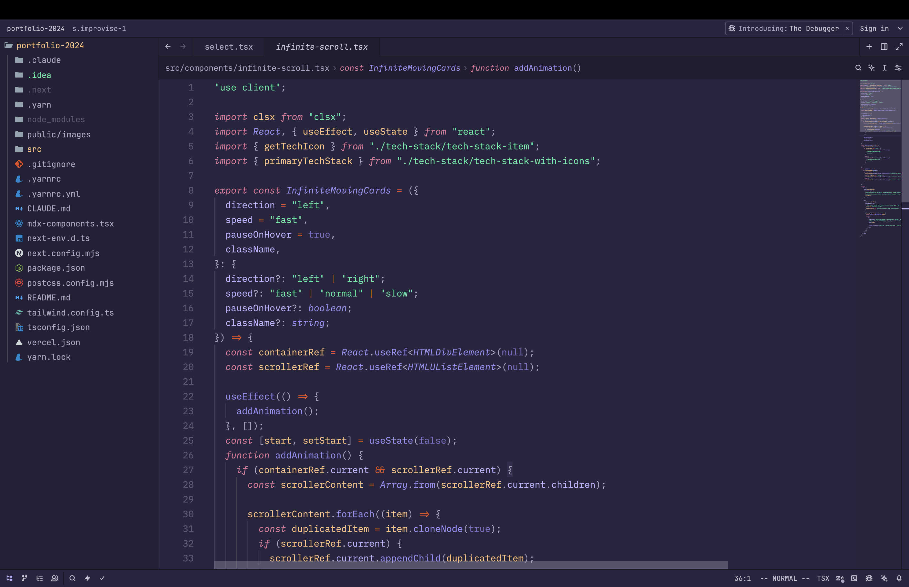

### Viola

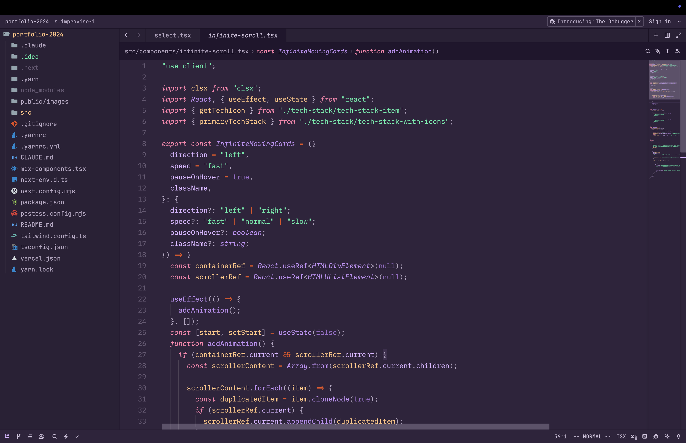

