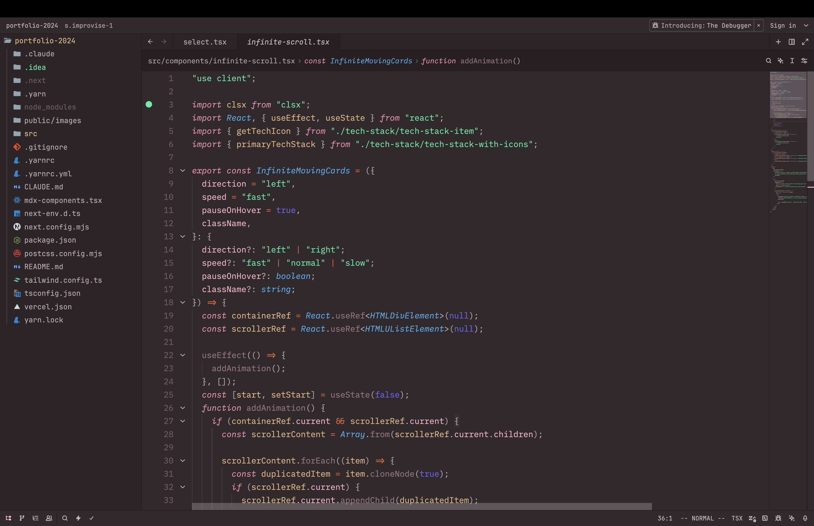

# Noctis theme ported from [Noctis](https://github.com/liviuschera/noctis)

## Theme Variants

### Noctis

### Azureus

### Bordo

### Hibernus

### Hibernus Light

### Lilac

### Lilac Light

### Lux

### Lux Light

### Minimus

### Obscuro

### Sereno

### Uva

### Viola

